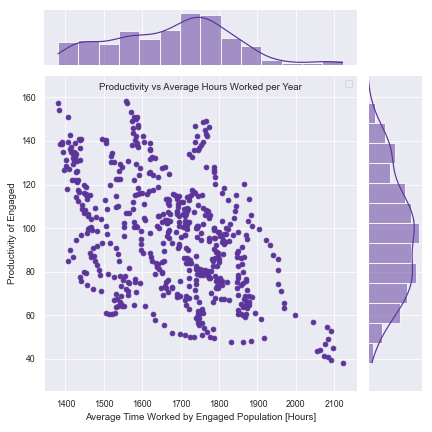
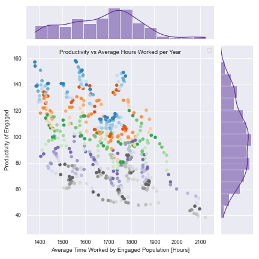
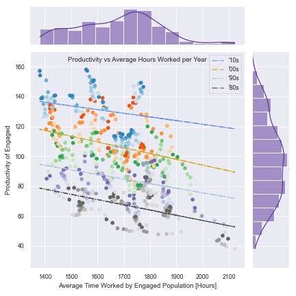

## **Introduction**
Our intro here

## **Exploratory Data Analysis**
Maybe throw in a correlation matrix, a quick plot or two etc

## Q1

## Research Question No. 2
Our Second research question wanted to explore *overworking*. We looked at trends of the average hours worked, along side our calculated quantification for productivity year over year. 

 <figcaption align="center"> Fig 1. Productivity of engaged plotted against the average time worked by said engaged populations in hours.  </figcaption>

 

In Fig 1. it is not immediately clear, however we observe an apparent negative relationship between the productivity of engaged vs the average time worked. We can dig deeper here, adding more information to the plot.

 <figcaption align="center"> Fig 1. Productivity of engaged plotted against the average time worked by said engaged populations in hours. Color indicates year in which the data point refers to, where the dark grey is the 1980s and blue the 2010s. </figcaption>
 
This added context makes the trends more obvious at first glace. The trends about similar colours, hence similar years, are demonstrating a negative relationship between the amount people work and the productivity they output. Let's add one more layer to this.

 

 <figcaption align="center"> Fig 1. Productivity of engaged plotted against the average time worked by said engaged populations in hours. A linear regression was performed to fit the trends for each decade. </figcaption>
 
At this point the negative relationship between productivity and hours worked is fully exposed. We applied a linear regression to the data points, grouped by decade. This was done to isolate the productivity vs time worked from any other confounding variables that change over large periods of time. 

 

All in all, we can say with confidence that increasing the hours engaged individuals work does not lead to a higher productive output for each of those hours worked. 

 

## Q3

## **Summary & Conclusion**
