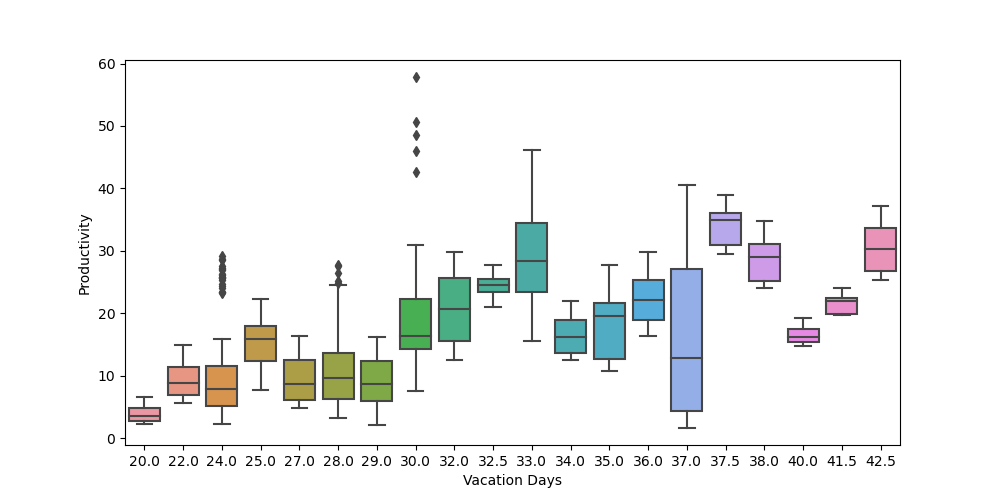
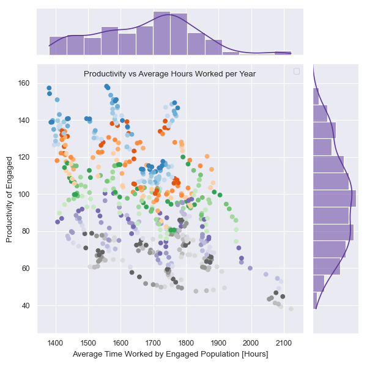
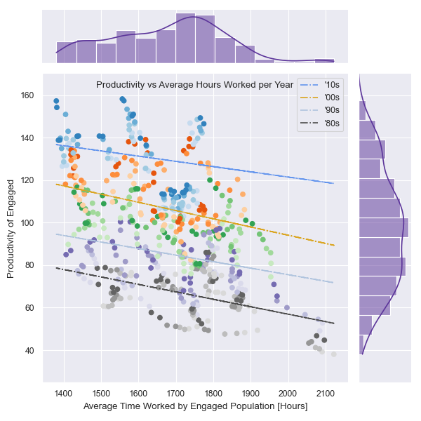

## **Introduction**
As a group, we were interested in exploring the welfare of workers. Specifically, we wanted to gain insight on what factors contributed to higher worker productivity. The main dataset we used was the Penn World Table, provided by the Groningen Growth and Development Centre from the University of Groningen. The PWT provides data on hours worked, GDP, relative output and many other variables related to economic productivity and worker welfare. We supplement this dataset with data from Huberman & Minns (2007) for information on allotted vacation days for workers.

Let’s introduce some of the terms we’ll be referencing in this report. 
- **RGDPO**, Output-side real GDP (millions 2005 USD). This uses prices for final goods exports and imports that are constant across countries an over time. Its a good measure of the output of an economy
- **Engaged**, an engaged individual is someone who participates in the economy through the sale of their labor. For example, these can be employees of companies or independent contractors.
- **HC** is the Human Capital Index. This is a measure of how access to healthcare, education, housing, and more contributes to the productivity of the next generation of workers.
- **EMP** is short for employed, and is the number of employed individuals (millions)
- **AVH** stands for 'average hours worked'. This is an average of the hours worked by engaged individuals of a population in a given calendar year. 

Lets start with a quick n' dirty exploratory analysis of the data we've gathered. 

## **Exploratory Data Analysis**
In our explanatory data analysis (EDA), we cleaned and refined the dataset and created graphs that would be interesting for our analysis, below we will discuss the highlights of our EDAs. First of all, a crucial part of our EDA was the analysis pipeline, which consisted of removing unwanted variables and rows, and adding variables from other datasets. For instance, we added data from 'days-of-vacation-and-holidays.csv' which had data on select countries about their average annual days of vacation in non-agricultural activities which we found was a captivating statistic as it lead to us drawing conclusions that having enough time away from work is crucial for higher productivity. This will be discussed in further detail later on. Secondly, one of the more useful graphs we created was the correlation matrix which was essential in visualizing and helping us find positive and weak correlations between our chosen variables. For example: 

<figcaption align="center"> Fig 1. Corellation matrix of interested variables. Redundancies removed to give this cornered matrix. </figcaption>

Thirdly, we calculated our own labor productivity measure by dividing ‘Output GDP’ by ‘average annual hours worked’ times ‘number of employees’. This productivity measure was labor productivity, also known as real economic output per unit of labor input. More explicitly, this new variable is a quantification of how many dollars of real output-side GDP was produced per hour worked by an engaged individual. We used this calculation throughout our EDA and analysis. 

## Q1 - The Effects of Vacation days on Productivity and GDP

We investigated the impact of the vacation days on the productivity of a country, and the recovery of a country’s GDP per vacation day after increasing vacation days. By examining the box plot below, there is a rough trend where vacation days below 30 annually are associated with a lower productivity, whereas vacation days over 30 are associated with a higher productivity. However, this trend is based on the medians of productivity, but the whiskers of many boxes cover a wide range showing large variations between countries. 

<figcaption align="center"> Fig 2. Bar plot showing productivity versus number of vacation days. </figcaption>
 
In the second figure below, two plots are shown. Both are plots of GDP per Vacation day versus Year, however, the left plot’s hue is based on the number of vacation days while the right plot’s hue is based on the average hours worked per year. 

An important thing to notice in these plots is that the maximum GDP per Vacation day correlates to a country with both high vacation days and a low average hours worked. That general property is obeyed for most of the points at high values on the Y-axis. This may indicate that countries with high vacation days and lower hours work tend to have higher value per vacation day.

Additionally, trends can be seen where as vacation days increase, the GDP per Vacation Day obviously drops. However, the slope after these drops is important: a positive slope after an increase indicates that the country remained prosperous afterwards, whereas a negative slope indicates that the country was not prosperous after increasing vacation days. Generally, positive slopes are seen after most increases except in the case where vacation days are already high. Overall this indicates that for countries with less than 35 vacation days per year, increasing generally wont negatively impact the country’s prosperity.

<figcaption align="center"> Fig 3. Two plots showing the GDP per capita divided by number of vacation days versus the year where each line represents a country. Colour of the left plot indicates the number of vacation days and colour of the right plot indicates the average hours worked for that year. </figcaption>

## Question 2 - How does Productivity Related to Average Hours Worked?

Our Second research question wanted to explore *overworking*. We looked at trends of the average hours worked, along side our calculated quantification for productivity year over year. 

 <figcaption align="center"> Fig 4. Productivity of engaged plotted against the average time worked by said engaged populations in hours.  </figcaption>

 

In Fig 1. it is not immediately clear, however we observe an apparent negative relationship between the productivity of engaged vs the average time worked. We can dig deeper here, adding more information to the plot.

 <figcaption align="center"> Fig 5. Productivity of engaged plotted against the average time worked by said engaged populations in hours. Color indicates year in which the data point refers to, where the dark grey is the 1980s and blue the 2010s. </figcaption>
 
This added context makes the trends more obvious at first glace. The trends about similar colours, hence similar years, are demonstrating a negative relationship between the amount people work and the productivity they output. Let's add one more layer to this.

 

 <figcaption align="center"> Fig 6. Productivity of engaged plotted against the average time worked by said engaged populations in hours. A linear regression was performed to fit the trends for each decade. </figcaption>
 
At this point the negative relationship between productivity and hours worked is fully exposed. We applied a linear regression to the data points, grouped by decade. This was done to isolate the productivity vs time worked from any other confounding variables that change over large periods of time. 

 

All in all, we can say with confidence that increasing the hours engaged individuals work does not lead to a higher productive output for each of those hours worked. 

 

## Question 3 - How does Productivity Related to Human Capital Index

Our third research question wanted to explore how the Human Capital Index (HCI) correlates with labor productivity. First of all, human capital index is a world bank measure that looks to quantify how much a country is contributing to its education and healthcare infrastructure for their working population. This means the higher a country scores on the HCI, the more educated and healthy the workforce and therefore, one can expect the more productive they will be as a result. 

 <figcaption align="center"> Fig 7. Productivity of engaged plotted against the Human Capital Index statistic. There is a clear strong positive correlation between the two variables. </figcaption>
 
 As evidenced by the above figure, the data suggests that a the higher the HCI of a country, the more productive the workforce. 

## **Summary & Conclusion**

In summary, through our research and analysis we have found certain variables that have a significant impact on labor productivity that countries should be mindful of if they want to increase their competitiveness in world economics. The data points towards the facts that workers need adequate amount of rest, that overworking is highly detrimental to overall productivity, and that countries absolutely need to invest in healthcare and education infrastructure to support their working population. If countries and businesses follow these practices, it will breed an environment for productivity to flourish. The world is now catching on to these ideas, for example, businesses in some countries such as the United Kingdom are now starting to convert to four day working weeks which is a testament to how rest is so incredibly important for productivity. 